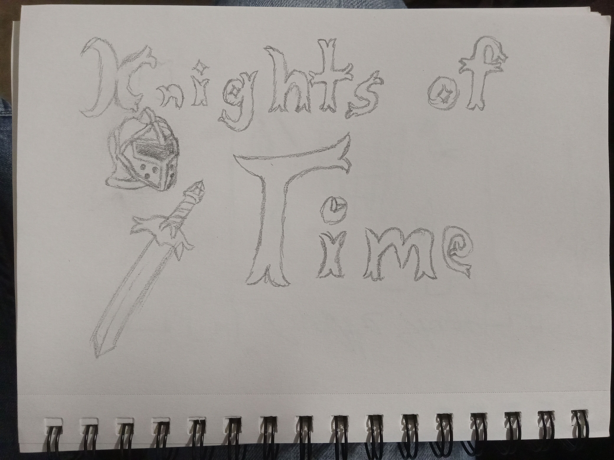
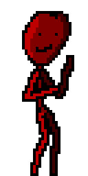
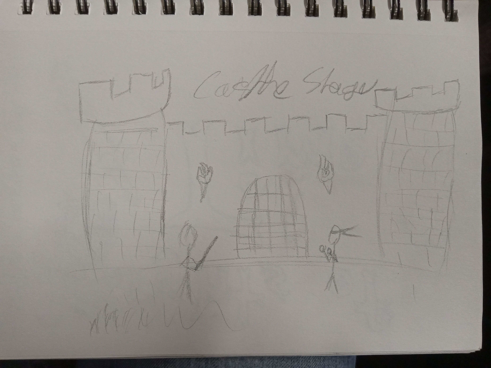

# ⚔️ Knights of Time

**Knights of Time** is a 2D hand-drawn fighting game built entirely in **C++**, featuring **fluid animation**, **responsive combat**, and **online multiplayer** support.  
Rendered with **[Raylib](https://www.raylib.com/)** and powered by **[ENet](https://github.com/zpl-c/enet)** for low-latency networking, it brings classic fighting gameplay into a modern, stylized world.

---

## 🕹️ Features

- 🎨 **Fully Hand-Drawn Art Style** – Every character, background, and animation is created by hand for a unique, expressive visual experience.  
- ⚔️ **Fast & Fluid Combat** – Smooth controls and detailed frame animations make every hit feel impactful.  
- 🌐 **Online Multiplayer** – Powered by **ENet**, offering reliable UDP-based networking for low-lag matches.  
- 🧠 **Deterministic Simulation** – Ensures consistent gameplay across clients, making multiplayer fair and accurate.  
- 🎵 **Original Soundtrack & Effects** – Immersive audio that enhances the medieval atmosphere.  
- 🧩 **Modular Architecture** – Built with scalability in mind; add new characters, arenas, or move sets easily.

---

## 🧰 Built With

| Component | Purpose |
|------------|----------|
| [Raylib](https://www.raylib.com/) | Rendering, input, audio, and window management |
| [ENet](https://github.com/zpl-c/enet) | Networking and multiplayer communication |
| C++20 | Core game logic and systems |

---

## 🚀 Getting Started

### Prerequisites

Make sure you have the following installed:

- **C++20 compiler** (GCC, Clang, or MSVC)
- **Raylib** (compiled or installed via package manager)
- **ENet** library

---

## 🧠 Development Notes

- Physics & Rendering: Handled through Raylib’s simple yet powerful API, optimized for 2D performance.
- Networking: ENet ensures reliable UDP packet delivery, ideal for real-time multiplayer fighting games.
- Game Loop: Custom engine loop designed around deterministic physics updates and decoupled rendering.

---

## 📸 Screenshots

- 
- 
- 

---

## 🏰 About

Knights of Time is a passion project built from the ground up to blend classic 2D fighting gameplay with a modern networking architecture and handcrafted visuals.
Step into the arena and fight for your era!
